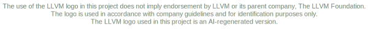
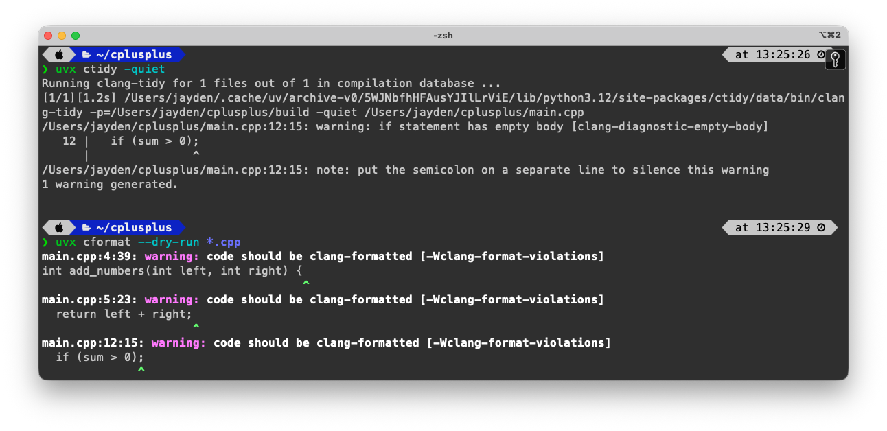

<p align="center">
    
    <br>
    
</p>

<span align="center">

# cppllvm

</span>

<p align="center">
    <a href="https://pypi.org/project/ctidy/"></a>
    <a href="https://pypi.org/project/cformat/"></a>
</p>

<p align="center">
    <a href="https://github.com/BayernMuller/cppllvm/actions/workflows/checks.yml"></a>
    <a href="https://github.com/BayernMuller/cppllvm/actions/workflows/wheel-ctidy.yml"></a>
    <a href="https://github.com/BayernMuller/cppllvm/actions/workflows/wheel-cformat.yml"></a>
    <a href="https://github.com/BayernMuller/cppllvm/actions/workflows/release-ctidy.yml"></a>
    <a href="https://github.com/BayernMuller/cppllvm/actions/workflows/release-cformat.yml"></a>
</p>

### Overview



`cppllvm` makes it easy to set up a consistent C/C++ developer environment with Python packaging.

Instead of asking every developer or CI job to install and manage a matching LLVM toolchain by hand, you can install `ctidy` and `cformat` with `uv` and immediately get reproducible `clang-tidy` and `clang-format` commands in your environment.

This is useful when you want:

- fast setup for new developers
- the same lint/format tool versions in local development and CI
- LLVM tooling without depending on a system package manager
- Python-managed C/C++ tooling that is easy to add, pin, and upgrade

### Releases


| Package | PyPI project | Release trigger | Package docs |
| --- | --- | --- | --- |
| `ctidy` | [ctidy](https://pypi.org/project/ctidy/) | `ctidy-v*` tag | [packages/ctidy/README.md](packages/ctidy/README.md) |
| `cformat` | [cformat](https://pypi.org/project/cformat/) | `cformat-v*` tag | [packages/cformat/README.md](packages/cformat/README.md) |


PyPI releases are wheel-only. Neither package publishes an `sdist`.

### Platform Availability

Available wheels are limited to the upstream LLVM 20 prebuilt assets pinned by this repository.


| Platform | Python ABI | `ctidy` | `cformat` |
| --- | --- | --- | --- |
| Linux `x86_64` | `cp39+` | ✅ | ✅ |
| macOS `x86_64` | `cp39+` | ✅ | ✅ |
| macOS `arm64` | `cp39+` | ✅ | ✅ |
| Windows `x86_64` | `cp39+` | ✅ | ✅ |


If the upstream static build release does not publish an asset for an OS/CPU pair, this repository does not produce a wheel for that platform.

### Installation

Recommended package installation is with `uv`:

```bash
uv add ctidy
uv add cformat
```

For one-off usage without modifying a project environment, use `uvx`:

```bash
uvx ctidy --version
uvx cformat --version
```

Package-specific usage and examples live in the package READMEs.

### Build And Distribution Model

This repository does not build LLVM from source. During wheel builds, each package only:

- downloads pinned prebuilt static binaries from `muttleyxd/clang-tools-static-binaries`
- verifies their `.sha512sum` files
- for `ctidy`, downloads official LLVM release headers for `lib/clang/<major>/include`
- for `ctidy`, bundles the upstream LLVM `run-clang-tidy.py`

### Repository Layout

```text
packages/
  cformat/   Python package for bundled clang-format
  ctidy/     Python package for bundled clang-tidy tools
tests/       Repository-level tests for packaging and CLI behavior
tools/       Release and maintenance helpers
```

### Local Development

Install the workspace tooling:

```bash
uv sync --group dev
```

Run the repository checks:

```bash
PYTHONPATH=packages/ctidy/src:packages/cformat/src:. python -m unittest discover -s tests
ruff check .
ty check .
```
